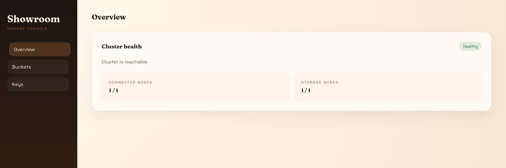

# Showroom

## Overview

**Showroom** is frontend for [Garage](https://garagehq.deuxfleurs.fr/), an S3-compatible object storage service. Garage is great, but lacks an UI. With Showroom you can:

- check your cluster's health
- manage your buckets and your keys



> Showroom is currently compatible only with V1 API. V2 API support is coming soon.

## Install

Run the prebuilt image and set the API upstream at runtime:

```bash
docker run --rm -p 8090:80 \
  -e SHOWROOM_API_UPSTREAM=http://your-garage-instance:3903 \
  showroom:latest
```

The compose file has a simple setup that includes the Garage service and Showroom.
